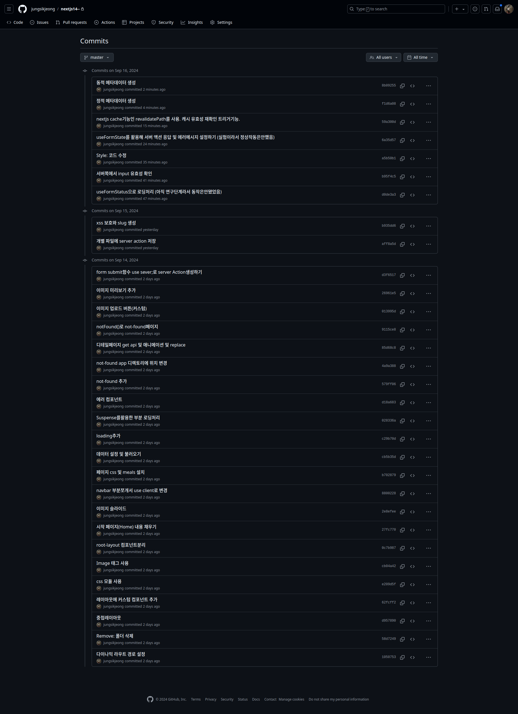

<h1>nextjs14 핵심(APP Router)</h1>

<h2>주요 내용 리스트</h2>

- 다이나믹 라우트 경로 설정 : `[slug]`
- not-fount 페이지 : 루트디렉토리 및 하위 page폴더에 적용가능
- error 페이지 : 루트디렉토리 및 하위 page폴더에 적용가능
- form submit 함수 `use server`컴포넌트인 server action생성
- 캐시 유효성 재확인 트리거 기능 : `revalidatePath` (yarn build했을때 페이지가 데이터를 다시 가져올 수 있게..)
- 동적 메타데이터 및 정적 메타데이터 설정

<h2>전체 리스트</h2>

